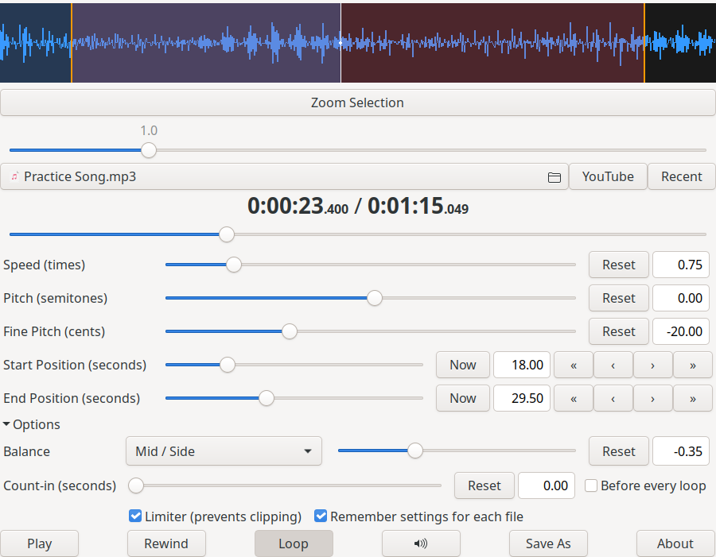

==============
Play it Slowly
==============

Play it Slowly plays an audio file at a different speed without changing its
pitch, or at a different pitch without changing its speed. It helps you practise
and transcribe music.

This is a maintained fork of `Jonas Wagner's Play it Slowly
<https://github.com/jwagner/playitslowly>`_, which is no longer developed. It runs
on current Linux systems and adds features from his web app `TimeStretch Player
<https://29a.ch/timestretch/>`_ and from `SlowPlay
<https://github.com/aFunkyBass/slowplay>`_, another player inspired by Play it Slowly.

Features
========
* Speed, pitch in semitones and fine pitch in cents
* A waveform you can zoom with the mouse wheel, with draggable loop markers
* Looping between a start and end position, with buttons that nudge each by 10 or 100 ms
* Balance modes: Left / Right fades one side, Balance plays one channel in mono
  on both speakers at the ends, and Mid / Side keeps only the middle (usually
  the vocals) or only the sides
* A count-in before playing, optionally before every loop
* A limiter that keeps loud passages from clipping
* Download the audio of a YouTube video to practise with (needs yt-dlp)
* Save As exports the result, or just the loop section, as WAV, MP3, Ogg Vorbis
  or FLAC, picked by the file extension
* Drop a file on the window to open it; settings are remembered for each file

Installation
============
Packages for each release are on the `releases page
<https://github.com/BeatLink/playitslowly/releases>`_:

* **Debian, Ubuntu and derivatives**: ``sudo apt install ./playitslowly_*.deb``
* **Fedora**: ``sudo dnf install ./playitslowly-*.noarch.rpm``
* **Flatpak**: ``flatpak install --user ./playitslowly.flatpak``
* **AppImage**: make it executable and run it

With Nix, run it straight from the repository with
``nix run github:BeatLink/playitslowly``, or add the flake to your configuration
and install ``packages.<system>.default`` (an overlay is also provided).

From source
-----------
You need Python 3, PyGObject, GTK 3, NumPy, and GStreamer 1.0 with the base,
good and bad plugin sets (the bad set provides the soundtouch ``pitch``
element). Install ``gst-libav`` for AAC files and ``yt-dlp`` and ``ffmpeg`` for
YouTube downloads. On Debian or Ubuntu::

  sudo apt install python3-gi python3-gi-cairo python3-numpy gir1.2-gtk-3.0 \
      gstreamer1.0-plugins-good gstreamer1.0-plugins-bad gstreamer1.0-libav yt-dlp ffmpeg

Then install with ``sudo make install`` (``PREFIX`` defaults to ``/usr/local``)
and remove it again with ``sudo make uninstall``.

Keyboard shortcuts
==================
Single keys are ignored while you type in a text field.

=====================  ======================================================
Key                    Action
=====================  ======================================================
Space                  Play or pause
s, a or [              Set the start position to the current position
e, b or ]              Set the end position to the current position
l                      Turn looping on or off
0 or Home              Go to the start position (Home: the song start when not looping)
1-9 or Ctrl+1-9        Rewind that many seconds
Left / Right           Skip back or forward 5 seconds
Ctrl+A / Ctrl+B        Reset the start or end position
Ctrl+O, Ctrl+R         Open a file, open a recent file
Ctrl+Y                 Download from YouTube
Ctrl+Q                 Quit
=====================  ======================================================

The number pad is laid out for practising with one hand, after SlowPlay:

=====================  ======================================================
Number pad key         Action
=====================  ======================================================
0                      Play or pause
. (decimal point)      Stop and go back to the start
1 / 4 / 7              Skip back 5, 10 or 15 seconds
3 / 6 / 9              Skip forward 5, 10 or 15 seconds
2 / 8 / 5              Slow down or speed up by 5 percent, or reset the speed
\- / +                 Transpose down or up a semitone
/ and \*               Set the start or end position
=====================  ======================================================

Selecting the audio output device
=================================
Pass a GStreamer sink with ``--sink``, for example::

  playitslowly "--sink=alsasink device=hw:1"
  playitslowly --sink=pipewiresink

Testing
=======
The tests play into silent sinks, so they need a display but no sound card::

  xvfb-run -a python3 -m pytest tests

They need pytest plus the dependencies listed under "From source". With Nix,
``nix flake check`` runs them in the build sandbox. CI runs them on every push.

Building packages
=================
GitHub Actions builds and starts every package on each push, see
``.github/workflows/packages.yml``. Pushing a ``v*`` tag attaches them to a
release. The recipes are ``debian/`` (``dpkg-buildpackage -us -uc -b``),
``packaging/rpm/playitslowly.spec`` (``make dist`` first),
``packaging/flatpak/ch.x29a.playitslowly.yml`` (``flatpak-builder``) and
``packaging/appimage/AppImageBuilder.yml`` (``appimage-builder``).

License
=======
Copyright (C) 2009 - 2016  Jonas Wagner, and the Play it Slowly contributors.

This program is free software: you can redistribute it and/or modify
it under the terms of the GNU General Public License as published by
the Free Software Foundation, either version 3 of the License, or
(at your option) any later version.

This program is distributed in the hope that it will be useful,
but WITHOUT ANY WARRANTY; without even the implied warranty of
MERCHANTABILITY or FITNESS FOR A PARTICULAR PURPOSE.  See the
GNU General Public License for more details.

You should have received a copy of the GNU General Public License
along with this program.  If not, see <http://www.gnu.org/licenses/>.

Bug reports and questions go to the `issue tracker
<https://github.com/BeatLink/playitslowly/issues>`_.
